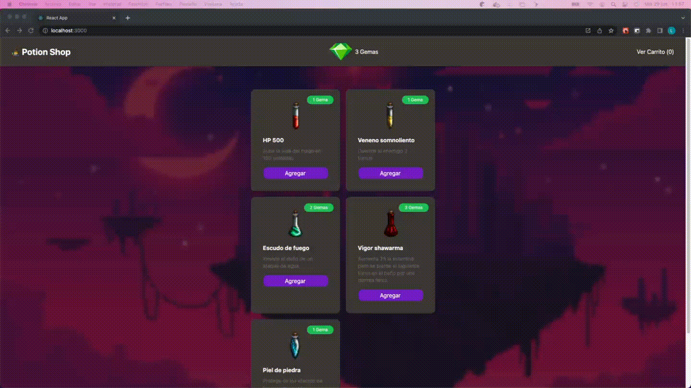

# Potion Shop

## Inicio

- Para empezar se deben instalar las dependencias del proyecto con el comando `npm install`
- Luego se debe levantar el backend con el comando `npm run server`. El mismo corre localmente en el puerto _3001_
- Luego podemos levantar el frontend con el comando `npm start`. Esto levanta un servidor de desarrollo en el puerto _3000_

## Contexto

Nuestro héroe 🧙‍♂️ necesita comprar pociones para combatir a 🐉 y salvar al mundo.

Sin embargo no vamos a simplemente regalarle las pociones por ser nobles, vamos a aprovecharnos de su necesidad.

Para eso tenemos que crear un marketplace para que pueda elegir sus pociones de una forma cómoda y nos de sus gemas con mas agrado.

## Restricciones

1. 🧙‍♂️ solo tiene 3 gemas asi que solo puede comprar pociones por un total de 3 gemas.
2. Por restricciones gubernamentales solo podemos ofrecerle comprar solo una poción de cada categoría.
3. 🧝‍♀️ la esposa de 🧙‍♂️ no nos permite venderle múltiples veces la misma poción, y no queremos averiguar que pasa si no la obedecemos.

## Notas

- Se debe visualizar en el medio de la barra de navegación la cantidad de gemas disponibles que le quedan a 🧙‍♂️ teniendo en cuenta los items que tiene en el carrito.
- Se debe visualizar en la parte derecha de la barra de navegacion la cantidad de items en el carrito
- Para realizar el carrito es preferible usar un Context

## Rutas

- Productos: Para ver los productos disponibles el backend dispone de una ruta /productos a la que se puede acceder con el metodo GET

```
GET /productos
response: [
  {
    "id": 1,
    "nombre": "HP 500",
    "precio": 1,
    "categoria": "Salud",
    "descripcion": "Sube la vida del mago en 100 unidades",
    "imagen": "http://localhost:3000/Icon1.png"
  }
]
```

- Compras: Para realizar la compra el backend dispone una ruta /compras a la que se puede acceder con el metodo POST y se debe enviar un objeto con el formato { itemsId: ARRAY_IDS }, donde ARRAY_IDS es un array con los ids de las pociones compradas

```
POST /compras
body: { itemsId: [1,2,3,4] }
```

## Demo


